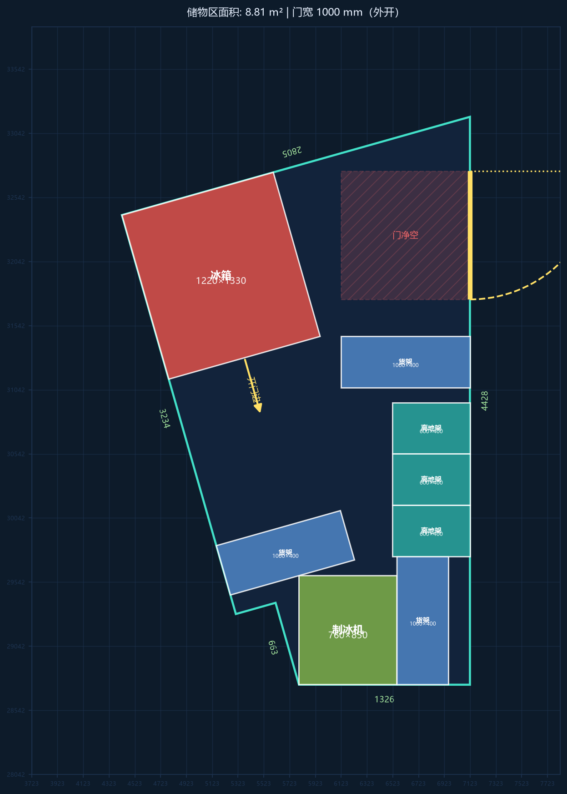
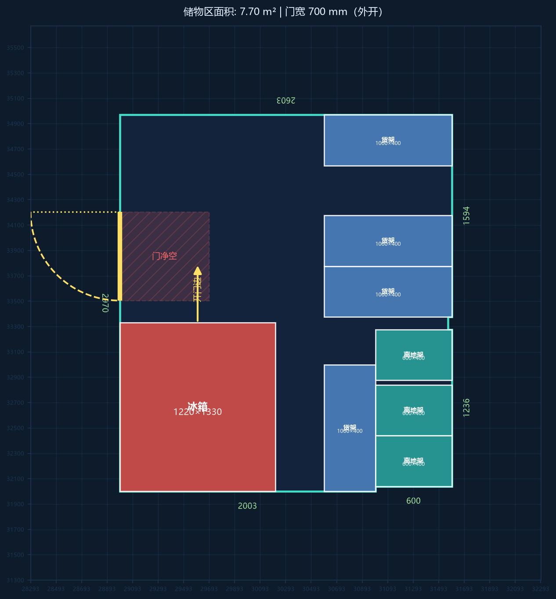
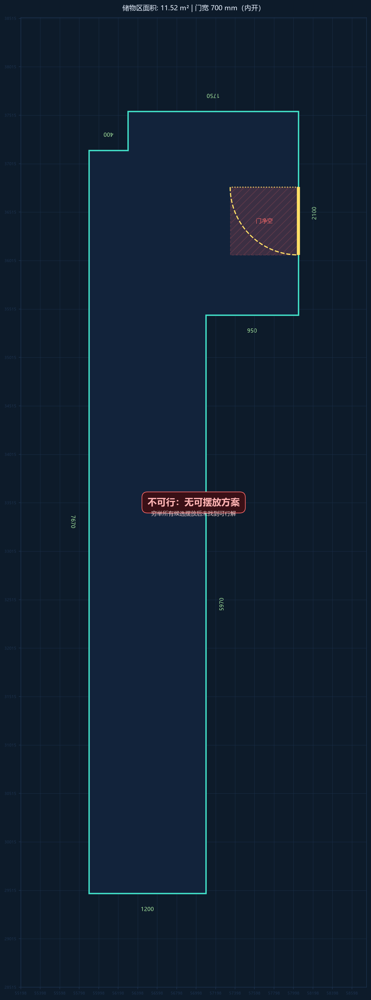
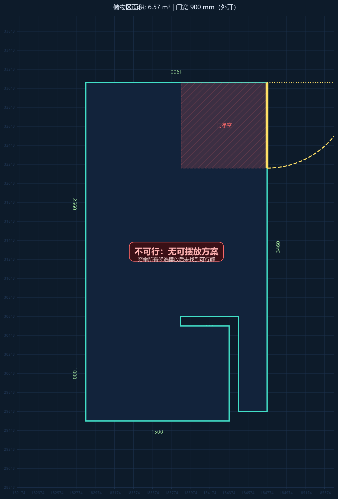

# 居灵 TakeHome 工程题 — 矩形摆放求解（README）

> 提交说明：本仓库为给定轮廓与物品的"是否可行 + 中心点/旋转角"求解器。
> 计划文档见 [solution/PLAN.md](solution/PLAN.md)。

## 0. 目录结构

```
TakeHome工程题/
├── README.md                  # 本文件
├── 居灵-TakeHome工程题/       # 题目原始材料（题目要求 + 示例 + 参考图，未改动）
└── solution/                  # 解题代码与结果
    ├── PLAN.md                # 解题计划（含规则口径与算法说明）
    ├── requirements.txt       # shapely / numpy / matplotlib / pytest
    ├── config.py              # 可调参数（容差、净空深度、超时等）
    ├── main.py                # 入口：python main.py <input.json>
    ├── verify.py              # 独立校验器
    ├── gen_tests.py           # 随机模糊测试
    ├── solver/                # io_model / geometry_utils / rules /
    │                          # candidates / search
    ├── visualize.py           # 结果图渲染（风格对齐题目参考图）
    ├── tests/                 # 单元测试 + 4 样例验收
    ├── data/                  # 4 个示例输入
    └── output/                # 每个示例：*.result.json + *.png
```

## 1. 核心代码实现逻辑说明

### 1.1 问题与规则口径（最终确认版）

输入为房间轮廓多边形 + 门（两端点 + 内外开标记）+ 若干矩形物品
（fridge/shelf/overShelf/iceMaker，尺寸 [length, width]）。

| 规则 | 实现口径 |
|---|---|
| 轮廓内 / 互不重叠 | shapely 多边形精确判定，允许贴边，容差 1e-3 mm |
| 门净空 | 门宽 N = 门两端点距离；**无论内外开门**，门内侧都保留 N×N 净空区，禁放物品；渲染区分内外开弧线 |
| 冰箱开门边 | 开门边取与 length 轴平行的边（两侧任选其一），外侧净空带深度 = **冰箱宽度值（尺寸对第 2 个数）**；净空带须完整在房间内且不含其他物品（开门边不能贴墙） |
| 旋转 | 物品可取 0°/90°，亦可旋转到与斜墙平行/垂直（斜墙同样参与贴墙候选） |
| 贴墙优先 | 两阶段：先求"每个物品至少贴一条墙"的解；无解再放宽为一般可行解 |

### 1.2 求解流程

```
输入 JSON → 场景构建（多边形规范化、墙段合并、门净空区、允许朝向）
  → 候选摆放位生成 → 两阶段回溯搜索 → 独立校验 → result.json + 结果图 PNG
```

- **候选位**：在物品自身坐标系中，用"特征线"（墙端点、房间顶点、已放物品边、
  门洞边的投影线）离散化，生成三类候选——贴墙（含斜墙沿线贴合）、贴已放物品、
  兜底网格；贴墙候选优先。
- **搜索**：物品按面积从大到小（确定性排序）逐件 DFS 回溯；每步用全局校验函数
  一次性复核所有约束（室内、互不重叠、不压门净空、冰箱净空带可用）；
  面积下界剪枝 + 超时保护（默认 60s）。
- **校验**：`verify.py` 重读输入与输出，逐条复核（旋转角属于允许朝向、
  输出物品与输入一一对应、全部几何约束），保证"声称可行即合法"。

### 1.3 AI 工具使用说明（按题目要求）

- **使用的 AI 工具**：DeepSeek（大模型编程助手，经 DeepSeek Harness 会话驱动），
  配合本地 Git Bash / Python 传统工具链。
- **AI 帮助的部分**：思路拆解与方案设计、核心算法（候选离散化 + 回溯）代码生成、
  代码调试（如墙段合并漏边、校验条件写反、候选裁剪导致超时等问题定位）、
  测试与模糊用例生成、文档撰写。
- **自己理解并调整的关键逻辑**：
  1. 规则语义本身有歧义，逐条与用户确认了口径——冰箱"开门边 + 净空深度 =
     冰箱宽度值"、内外开门统一 N×N 净空、斜墙可斜贴；
  2. 依据房间几何核算出 example3/4 在该口径下不可行（冰箱需连续 2660 mm，
     房间最宽 2150 mm），并将此结论固化为验收测试；
  3. 数值容差设计：输出坐标 4 位小数 + 接触面积容差 1 mm² 的匹配，避免
     "贴边被四舍五入误判为重叠"；
  4. 分阶段搜索策略（全贴墙优先、失败再放宽）与"求解/校验分离"的工程结构。

## 2. 运行环境与运行方式

- **语言**：Python 3.10+（开发验证环境 Python 3.12.10，Windows 11）
- **依赖**：`pip install -r solution/requirements.txt`
  （shapely ≥2.0、numpy、matplotlib ≥3.8、pytest）
- **字体**：结果图中文标签需要系统中文字体（Windows 自带微软雅黑即可，
  代码含字体回退）

```bash
# 求解单个输入（自动写 result.json 并生成 PNG）
cd solution
python main.py data/example1.json --out-dir output

# 一次跑全部 4 个示例
for f in data/example*.json; do python main.py "$f" --out-dir output; done

# 独立校验某个结果
python verify.py data/example1.json output/example1.result.json

# 单元测试
python -m pytest tests/ -q

# 随机模糊回归（例：30 例，种子 7）
python gen_tests.py 30 7
```

输出 JSON 格式（坐标单位 mm，rotation 为物品 length 轴相对 +x 的逆时针角度）：

```jsonc
{ "feasible": true, "placements": [ { "name": "shelf-1", "center": [x, y], "rotation": 0 } ] }
```

## 3. 既定输入的输出示例

### example1（可行，8 件全贴墙）



```json
{
  "feasible": true,
  "placements": [
    {
      "name": "iceMaker",
      "center": [
        6176.0344,
        29167.2128
      ],
      "rotation": 179.9746
    },
    {
      "name": "fridge",
      "center": [
        5191.8913,
        31931.0172
      ],
      "rotation": 15.852
    },
    {
      "name": "shelf-1",
      "center": [
        5691.0476,
        29770.423
      ],
      "rotation": 15.852
    },
    {
      "name": "shelf-2",
      "center": [
        6621.7357,
        31257.9304
      ],
      "rotation": 0
    },
    {
      "name": "shelf-3",
      "center": [
        6756.0676,
        29241.9559
      ],
      "rotation": 89.9746
    },
    {
      "name": "ov
```

### example2（可行，8 件全贴墙）



```json
[
  {
    "name": "fridge",
    "center": [
      29603.3885,
      32665.0295
    ],
    "rotation": 0
  },
  {
    "name": "shelf-1",
    "center": [
      30796.3885,
      32500.0295
    ],
    "rotation": 90
  },
  {
    "name": "shelf-2",
    "center": [
      31096.3885,
      33575.6321
    ],
    "rotation": 0
  }
]
```

### example3 / example4（按确认口径不可行）

> 口径：冰箱开门净空深度 = 冰箱宽度值(1330 mm)。此时冰箱需要"本体 1330 +
> 净空带 1330"共连续 **2660 mm** 的空间，而 example3 房间最宽区段仅 2150 mm、
> example4 最高区段仅 2460 mm，均无法容纳 → 输出 `feasible=false`。
> 若后续希望这两个示例可解，可将 `config.FRIDGE_OPEN_CLEARANCE` 调小后重跑。




```json
{
  "feasible": false,
  "placements": [],
  "reason": "穷举所有候选摆放后未找到可行解"
}
```

| 示例 | 物品数 | 面积占比 | 结果 | 阶段 |
|---|---|---|---|---|
| example1 | 8 | 47.5% | 可行 | 全贴墙 |
| example2 | 8 | 51.2% | 可行 | 全贴墙 |
| example3 | 9 | 37.7% | 不可行 | —（几何核算，非搜索失败） |
| example4 | 6 | 47.8% | 不可行 | —（几何核算，非搜索失败） |

## 4. 复现与扩展

- 任意符合输入 schema 的 JSON 都可运行；斜墙/凹多边形/多物品均支持。
- 规则参数（容差、门净空深度、冰箱净空深度、超时、网格步长）集中在
  `solution/config.py`，方便按需调整。
- 需要调整题目口径（如冰箱净空深度）时，只改参数并重跑即可，测试会自动回归。
